# Wdrożenie produkcyjne MVP — Plan Brief

> Full plan: `context/changes/production-deploy/plan.md`

## What & Why

BassMap PL ma działać pod publicznym adresem z pełnym MVP: fan widzi wydarzenia DnB na mapie i liście, admin zarządza eventami. Pierwszy deploy (2026-06-10) to był tylko smoke test scaffoldu (landing + auth) — produkcyjna baza nie ma jeszcze tabel `events`, a Worker nie serwuje kodu S-01/S-02.

## Starting Point

- Worker `bassmap-pl` na `https://bassmap-pl.ematrejek.workers.dev` — deploy scaffoldu z 10.06, sekrety CF + GitHub ustawione
- Supabase cloud EU (`dpqndrmvrkfahzyubrns.supabase.co`) — tylko Auth, bez migracji eventów
- CI/CD: `.github/workflows/ci.yml` + `deploy.yml` na gałęź `main`
- Kod MVP (admin CRUD, fan discovery, 5 migracji SQL) — w repo, zarchiwizowany S-01/S-02

## Desired End State

Aplikacja działa pod własną domeną `.pl` (DNS w Cloudflare), baza prod ma schemat wydarzeń i admina `matrejekemilia@gmail.com`, każdy push na `main` wdraża automatycznie. Fan otwiera stronę główną i widzi wydarzenia dodane przez admina; admin loguje się i zarządza CRUD przez `/admin`.

## Key Decisions Made

| Decision              | Choice                                              | Why (1 sentence)                                                          | Source |
| --------------------- | --------------------------------------------------- | ------------------------------------------------------------------------- | ------ |
| Adres publiczny       | Domena `.pl` (rejestrator PL → DNS Cloudflare)      | Cloudflare nie rejestruje `.pl`, ale obsługuje je jako strefę DNS         | Plan   |
| Dane startowe         | Puste — admin dodaje eventy ręcznie                 | Tylko prawdziwe dane, pełna kontrola                                      | Plan   |
| Potwierdzenie e-mail  | Wyłączone teraz, włączyć przed publicznym launch    | Łatwiejsze testy MVP; bezpieczeństwo przed udostępnieniem linku           | Plan   |
| Sposób deployu kodu   | Auto-deploy GitHub Actions na `main`                | Zgodne z tech-stack; każdy merge = produkcja                              | Plan   |
| Konto admina          | `matrejekemilia@gmail.com` (z migracji/seed)        | Spójność z allowlist w migracji `fix_admin_allowlist_email`               | Plan   |
| Migracje prod         | Agent uruchamia `supabase db push` (CLI + link)     | Szybciej niż ręczny SQL Editor; wymaga `supabase login`                   | Plan   |
| Preview w chmurze     | Tylko lokalny `npm run preview` w F-03              | Najprostsze dla solo MVP; PR preview → faza 2                             | Plan   |
| Dokumentacja          | Aktualizacja `deploy-plan.md` + `README.md`         | Jeden dokument operacyjny + onboarding dla współpracowników               | Plan   |

## Scope

**In scope:**

- `supabase link` + `supabase db push` (5 migracji) na projekt cloud
- Rejestracja konta Auth admina + weryfikacja allowlist
- Zakup domeny `.pl`, strefa DNS w Cloudflare, Custom Domain na Worker
- Aktualizacja Supabase Auth URLs (Site URL + Redirect URLs)
- Push kodu MVP na `main` → CI + auto-deploy
- Smoke test MVP (lista, mapa, `/events/[id]`, `/admin`, auth)
- Aktualizacja `context/deployment/deploy-plan.md` i `README.md`
- Poprawka gałęzi `master` → `main` w docs

**Out of scope:**

- Preview deploy na PR (Worker env) — dokumentacja jako faza 2
- Cron budzący Supabase free tier
- Workers Paid upgrade
- Włączenie confirm email (osobny krok przed publicznym launch)
- Seed przykładowych wydarzeń na prod

## Architecture / Approach

```mermaid
flowchart LR
  subgraph phase1 [Faza1_Baza]
    LINK[supabase_link]
    PUSH[db_push_5_migracji]
    AUTH[Konto_admin_Auth]
  end
  subgraph phase2 [Faza2_Domena]
    BUY[Kup_.pl_u_rejestratora]
    CF[Strefa_DNS_Cloudflare]
    CD[Custom_Domain_Worker]
  end
  subgraph phase3 [Faza3_Deploy]
    MAIN[Push_main]
    GHA[GitHub_Actions]
    WR[wrangler_deploy]
  end
  subgraph phase4 [Faza4_Weryfikacja]
    SB[Smoke_test_MVP]
    DOC[Aktualizacja_docs]
  end
  phase1 --> phase2 --> phase3 --> phase4
```

Worker (`bassmap-pl`) łączy się z Supabase cloud przez sekrety `SUPABASE_URL` / `SUPABASE_KEY`. Baza trzyma wydarzenia + RLS; aplikacja SSR na Cloudflare Workers serwuje strony fana i admina.

## Phases at a Glance

| Phase     | What it delivers                          | Key risk                                      |
| --------- | ----------------------------------------- | --------------------------------------------- |
| 1. Baza   | Schemat events + admin allowlist na prod  | Brak `supabase login` / zły project ref       |
| 2. Domena | Publiczny adres `.pl` → Worker            | Propagacja DNS 24–48 h; DNSSEC u rejestratora |
| 3. Deploy | Kod MVP live przez CI/CD                  | Push na złą gałąź (`master` vs `main`)        |
| 4. Testy  | Smoke MVP + zaktualizowana dokumentacja   | Leaflet/hydratacja na Workers runtime         |

**Prerequisites:** Konto Cloudflare (aktywne), projekt Supabase cloud, GitHub Secrets (4 szt.), Docker opcjonalnie (lokalny Supabase nie jest wymagany do prod push).

**Estimated effort:** ~2–3 sesje (baza + domena + deploy + testy); domena może wymagać 1–2 dni oczekiwania na DNS.

## Open Risks & Assumptions

- Domena `.pl` jeszcze nie kupiona — implementer musi wybrać nazwę i rejestratora (home.pl, nazwa.pl, OVH)
- Supabase free tier usypia się po 7 dniach bezczynności — obudzić przed demo
- Geokodowanie Nominatim z IP Workera może trafić w limity rate — monitorować przy dodawaniu eventów
- Rollback Workera (`wrangler rollback`) nie cofa migracji DB
- `matrejekemilia@gmail.com` musi mieć konto Auth w prod Supabase (rejestracja przez `/auth/signup`)

## Success Criteria (Summary)

- Strona główna pod domeną `.pl` pokazuje wydarzenia dodane przez admina (lista + mapa)
- Admin loguje się, dodaje/edytuje/usuwa wydarzenie przez `/admin`
- Push na `main` automatycznie wdraża bez ręcznego `wrangler deploy`
