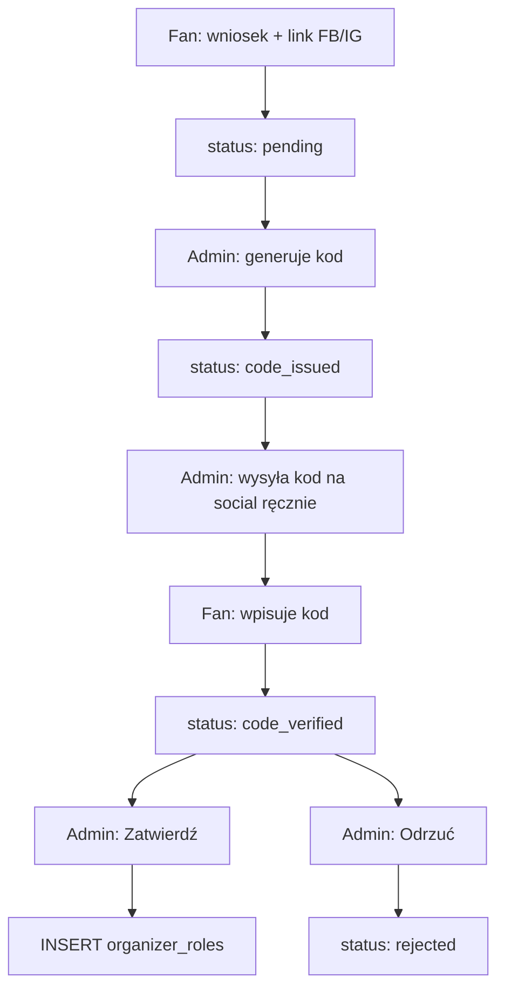

# Rola organizatora i weryfikacja (F-05) Implementation Plan

## Overview

Slice roadmapy **F-05** (`change-id`: **`organizer-role-foundation`**). Zalogowany fan składa **wniosek o status organizatora** z linkiem do oficjalnego profilu Facebook lub Instagram. Admin generuje **kod weryfikacyjny**, wysyła go ręcznie z kont BassMap PL na wskazany profil, użytkownik wpisuje kod w aplikacji, a admin po weryfikacji **zatwierdza** lub **odrzuca** wniosek. Po akceptacji konto dostaje rolę `organizer` (dodatkowo do roli fana). Fundament guardów API i middleware odblokowuje późniejszy slice **S-25** (self-service eventów).

**Issue:** [#45](https://github.com/ematrejek/bassmap-pl/issues/45). **Research:** `context/changes/organizer-role-foundation/research.md`.

## Current State Analysis

- **Role model:** binarny `admin` vs fan. Admin przez `admin_allowlist` + RPC `is_admin()` (`src/lib/auth/admin.ts`, migracje F-01/F-02). Brak `organizer`.
- **Middleware** (`src/middleware.ts`): ustawia `locals.user` i `locals.isAdmin`; chroni `/admin` i ścieżki fana (`PROTECTED_ROUTES`).
- **Panel admina** (`src/pages/admin/index.astro`): sekcje „Sugestie zmian” i „Do moderacji” – wzorzec kolejki moderacji.
- **Profil fana** (`src/pages/profile.astro`): `ProfileSection`, `DeleteAccountSection` – miejsce na sekcję wniosku organizatora.
- **Brak** tabel `organizer_applications` / `organizer_roles`, guardów `requireOrganizer`, UI wniosku, legal sync dla danych organizatora.

### Key Discoveries:

- Wzorzec roli: `resolveIsAdmin` + `requireAdmin` + RLS `is_admin()` – ten sam model dla `is_organizer()` i tabeli `organizer_roles` (`context/archive/2026-06-10-admin-role-guard/plan.md`).
- Kolejka moderacji: `change_suggestions` + `crew_join_requests` – statusy, partial unique index na jeden aktywny wniosek, SECURITY DEFINER RPC dla atomowych akcji.
- Fan endpoints blokują **admina** (`context.locals.isAdmin`), nie organizatora – organizator nadal korzysta ze strefy fana.
- Publikacja eventów przez organizatora wymaga osobnej polityki RLS w S-25 – samo `is_organizer` nie zmienia `events_insert_fan`.

## Desired End State

1. Fan (nie-admin, bez roli organizer) na `/profile` składa wniosek: nazwa organizatora, platforma (Facebook lub Instagram), URL profilu, krótki opis.
2. Admin w panelu widzi kolejkę wniosków, generuje kod, wysyła go ręcznie z kont BassMap PL na podany profil social.
3. Użytkownik wpisuje kod w aplikacji; system weryfikuje hash kodu (bez ujawniania kodu w API/DB).
4. Po poprawnym kodzie wniosek trafia do finalnej kolejki admina → **Zatwierdź** nadaje rolę `organizer` atomowo; **Odrzuć** z opcjonalnym powodem.
5. Odrzucony użytkownik może złożyć **nowy** wniosek (jeden aktywny wniosek naraz).
6. `locals.isOrganizer`, `requireOrganizer()` i RPC `is_organizer()` działają fail-closed.
7. Polityka prywatności i regulamin opisują przetwarzanie danych wniosku organizatora.

### Weryfikacja ręczna

- Fan: wniosek → status „Czekamy na kod” → po wysłaniu kodu przez admina wpisuje kod → status „Zweryfikowany – oczekuje na decyzję”.
- Admin: generuje kod, wysyła na FB/IG, po wpisaniu kodu przez użytkownika zatwierdza → użytkownik ma `isOrganizer`.
- Odrzucenie z powodem widoczne dla użytkownika; nowy wniosek możliwy.
- Organizator **nie** publikuje eventów bez moderacji (to S-25).

## What We're NOT Doing

- Self-service dodawania eventów (`published` bez `pending`) – **S-25**
- Ogłoszenia na forum «Ogłoszenie wydarzenia» – **S-25**
- Automatyczna weryfikacja KRS/NIP / scraping – parked
- Integracja API Facebooka lub Instagrama (wiadomość wysyłana ręcznie z kont BassMap PL)
- Publiczna odznaka „zweryfikowany organizator” na profilu – poza F-05 (opcjonalnie status wniosku tylko dla właściciela konta)
- Panel organizatora z osobną nawigacją – **S-25**
- Zmiana `events` RLS dla organizatora – **S-25**

## Implementation Approach

Cztery fazy sekwencyjne: (1) schemat DB + RPC weryfikacji, (2) auth layer + API, (3) UI fan + admin, (4) legal + testy. Defense in depth: guardy TypeScript + RLS + SECURITY DEFINER dla mutacji statusu i nadania roli.

## Critical Implementation Details

**Statusy wniosku** (`organizer_application_status` enum):

| Status          | Znaczenie                                               |
| --------------- | ------------------------------------------------------- |
| `pending`       | Wniosek złożony; admin może wygenerować kod             |
| `code_issued`   | Kod wygenerowany (hash w DB); użytkownik musi go wpisać |
| `code_verified` | Kod poprawny; czeka na finalną decyzję admina           |
| `approved`      | Rola przyznana (terminalny)                             |
| `rejected`      | Odrzucony; opcjonalny `decision_reason` (terminalny)    |

**Kod weryfikacyjny:** 6–8 znaków alfanumerycznych (bez mylących znaków); generowany w RPC admina; w DB tylko `verification_code_hash` (np. `crypt()` / `digest` + salt w wierszu). API nigdy nie zwraca kodu po wygenerowaniu – admin widzi go **jednorazowo** w odpowiedzi RPC/UI przy generowaniu. Ponowne generowanie unieważnia poprzedni hash.

**Jeden aktywny wniosek:** partial unique index `UNIQUE (user_id) WHERE status IN ('pending', 'code_issued', 'code_verified')`. Użytkownik z `organizer_roles` nie może składać nowego wniosku.

**Atomowa akceptacja:** RPC `approve_organizer_application(p_application_id)` – `FOR UPDATE`, sprawdza `code_verified`, `INSERT organizer_roles ON CONFLICT DO NOTHING`, ustawia `approved` + `reviewed_by` + `reviewed_at` w jednej transakcji.

**Usuwanie konta:** `organizer_applications` i `organizer_roles` – `ON DELETE CASCADE` na `user_id` (spójne z S-16).

## Phase 1: Schemat bazy i RPC weryfikacji

### Overview

Tabele `organizer_applications` i `organizer_roles`, enum statusów, RLS, funkcje `is_organizer()`, issue/verify/approve/reject.

### Changes Required:

#### 1. Migracja SQL

**File**: `supabase/migrations/20260629100000_organizer_role_foundation.sql`

**Intent**: Persistencja wniosków, ról organizatora i bezpiecznych przejść statusów.

**Contract**:

- `CREATE TYPE organizer_social_platform AS ENUM ('facebook', 'instagram');`
- `CREATE TYPE organizer_application_status AS ENUM ('pending', 'code_issued', 'code_verified', 'approved', 'rejected');`
- Tabela `organizer_applications`: `id`, `user_id`, `business_name` (CHECK długości), `social_platform`, `social_profile_url` (CHECK URL), `description` (opcjonalny, max długość), `status`, `verification_code_hash`, `code_issued_at`, `code_verified_at`, `code_attempt_count`, `reviewed_by`, `reviewed_at`, `decision_reason`, `created_at`, `updated_at`
- Tabela `organizer_roles`: `user_id` PK, `granted_by`, `granted_at`, `application_id` (opcjonalny FK do zatwierdzonego wniosku)
- Partial unique: jeden aktywny wniosek per user; partial unique: user bez duplikatu w `organizer_roles`
- `is_organizer()` – SECURITY DEFINER, `EXISTS` w `organizer_roles` dla `auth.uid()`, `GRANT EXECUTE TO authenticated`
- `issue_organizer_verification_code(p_application_id uuid)` – tylko admin, status `pending` → `code_issued`, zwraca plaintext kod **tylko w wyniku RPC** (implementer: użyć `gen_random_bytes` + encoding czytelny dla admina)
- `verify_organizer_application_code(p_application_id uuid, p_code text)` – właściciel wniosku, status `code_issued`, porównanie hash, limit prób (np. 5), sukces → `code_verified`
- `approve_organizer_application(p_application_id uuid)` – admin, `code_verified` → `approved` + insert role
- `reject_organizer_application(p_application_id uuid, p_reason text)` – admin, aktywny wniosek → `rejected`
- Trigger `organizer_applications_restrict_mutable_columns` – po submit fan może zmieniać tylko dozwolone pola (lub brak UPDATE dla fana poza verify przez RPC)
- RLS: fan SELECT own; fan INSERT own `pending` jeśli nie ma roli i brak aktywnego wniosku; admin SELECT all; `organizer_roles` – REVOKE direct SELECT dla authenticated (jak `admin_allowlist`), odczyt statusu przez RPC lub widok own-row
- `REVOKE ALL ON organizer_roles FROM anon, authenticated` + dostęp przez `is_organizer()` only

#### 2. Typy TypeScript

**File**: `src/types.ts`

**Intent**: Typy dla wniosku, statusów i platformy social.

**Contract**: Eksport `OrganizerApplicationStatus`, `OrganizerSocialPlatform`, `OrganizerApplication`, `OrganizerApplicationListItem` (admin – bez hash kodu).

### Success Criteria:

#### Automated Verification:

- `npx supabase db reset` stosuje migrację bez błędu
- `npm run lint` przechodzi po dodaniu typów

#### Manual Verification:

- W Supabase Studio: INSERT testowy wniosek `pending` przez service role
- RPC `issue` → `verify` → `approve` działa w SQL Editor z kontekstem JWT (lub w testach integracyjnych fazy 4)

**Implementation Note**: Po fazie 1 – potwierdzenie manualne przed fazą 2.

---

## Phase 2: Warstwa auth i API

### Overview

Resolver organizatora, guardy, endpointy fan i admin.

### Changes Required:

#### 1. Resolver roli organizatora

**File**: `src/lib/auth/organizer.ts` (nowy)

**Intent**: Fail-closed sprawdzenie roli przez RPC `is_organizer()`.

**Contract**: `resolveIsOrganizer(supabase, user): Promise<boolean>` – wzorzec jak `resolveIsAdmin`.

#### 2. Guardy

**File**: `src/lib/auth/guards.ts`

**Intent**: Ochrona endpointów organizatora (przyszłe S-25) i spójne błędy JSON po polsku.

**Contract**: `requireOrganizer(locals): Response | null` – 401/403 jak `requireAdmin`.

#### 3. Middleware i typy

**Files**: `src/middleware.ts`, `src/env.d.ts`

**Intent**: `locals.isOrganizer` na każdym request (równolegle z `isAdmin`).

**Contract**: Po `resolveIsAdmin` wywołaj `resolveIsOrganizer`; gdy brak supabase → `false`.

#### 4. Serwis wniosków

**File**: `src/lib/services/organizer-applications.ts` (nowy)

**Intent**: Logika biznesowa między API a RPC Supabase.

**Contract**:

- `createOrganizerApplication(supabase, userId, input)` – walidacja Zod, INSERT lub RPC
- `getOwnOrganizerApplication(supabase, userId)` – ostatni/aktywny wniosek bez wrażliwych pól
- `listOrganizerApplicationsForAdmin(supabase)` – kolejka z loginem/e-mailem z `resolveSubmitterProfiles` (wzorzec `admin/index.astro`)
- `issueVerificationCode`, `verifyCode`, `approveApplication`, `rejectApplication` – opakowania RPC

#### 5. Schema Zod

**File**: `src/lib/organizer/application-schema.ts` (nowy)

**Intent**: Walidacja formularza wniosku i wpisywania kodu.

**Contract**:

- `businessName`: 2–120 znaków
- `socialPlatform`: `facebook` | `instagram`
- `socialProfileUrl`: URL pasujący do platformy (host facebook.com / instagram.com)
- `description`: opcjonalny, max 1000 znaków
- `verificationCode`: 6–8 znaków przy verify

#### 6. API fan

**Files**:

- `src/pages/api/fan/organizer-application/index.ts` – `GET` (status własnego wniosku), `POST` (submit)
- `src/pages/api/fan/organizer-application/verify-code.ts` – `POST` wpisanie kodu

**Intent**: Endpointy dla zalogowanego fana (nie blokować `isOrganizer` w ścieżkach fana – tylko `isAdmin` jak dziś).

**Contract**: `export const prerender = false`; `requireAuth`; Zod; komunikaty PL; 409 gdy aktywny wniosek lub już organizer.

#### 7. API admin

**Files**:

- `src/pages/api/admin/organizer-applications/[id]/issue-code.ts` – `POST` generuj kod
- `src/pages/api/admin/organizer-applications/[id]/approve.ts` – `POST`
- `src/pages/api/admin/organizer-applications/[id]/reject.ts` – `POST` body `{ reason?: string }`

**Intent**: Moderacja wniosków – wzorzec `src/pages/api/admin/change-suggestions/[id]/status.ts`.

**Contract**: `requireAdmin`; walidacja UUID; mapowanie błędów RPC na 400/404/409.

### Success Criteria:

#### Automated Verification:

- `tests/unit/require-organizer.test.ts` – guardy
- `tests/unit/organizer-application-schema.test.ts` – walidacja URL i pól
- `tests/unit/organizer-applications-api.test.ts` – mocki API (wzorzec `fan-change-suggestions-api.test.ts`, `as unknown as APIContext`)
- `npm run check` i `npm run lint` przechodzą

#### Manual Verification:

- `curl`/Playwright: fan POST wniosek → 201; admin issue-code → plaintext w odpowiedzi; fan verify → 200; admin approve → fan ma `isOrganizer`

**Implementation Note**: Po fazie 2 – potwierdzenie manualne przed fazą 3.

---

## Phase 3: UI użytkownika i panel admina

### Overview

Formularz wniosku na profilu, wpisywanie kodu, kolejka admina z akcjami.

### Changes Required:

#### 1. Sekcja wniosku na profilu

**Files**: `src/components/fan/OrganizerApplicationSection.tsx` (nowy), `src/pages/profile.astro`

**Intent**: Fan widzi stan wniosku i formularz lub pole na kod.

**Contract**:

- `client:only="react"` (wzorzec Radix/heavy state – `context/foundation/lessons.md`)
- Stany UI: brak wniosku → formularz; `pending` → komunikat „Administrator wyśle kod na Twój profil”; `code_issued` → input kodu + submit; `code_verified` → „Oczekuje na decyzję”; `approved` → „Jesteś zweryfikowanym organizatorem”; `rejected` → powód + przycisk „Złóż ponownie”
- Pola: nazwa organizatora, wybór FB/IG, URL profilu, opis
- Link do polityki prywatności przy submit (RODO)

#### 2. Kolejka admina

**Files**:

- `src/components/admin/OrganizerApplicationsTable.tsx` (nowy)
- `src/components/admin/OrganizerApplicationActions.tsx` (nowy – generuj kod, zatwierdź, odrzuć)
- `src/pages/admin/index.astro`

**Intent**: Trzecia sekcja panelu admina „Wnioski organizatorów”.

**Contract**:

- Kolumny: data, nazwa, platforma, URL profilu (link), login/e-mail zgłaszającego, status
- Akcje per status: `pending`/`code_issued` → „Generuj kod” (modal z jednorazowym wyświetleniem kodu + instrukcja: wyślij z konta BassMap PL); `code_verified` → Zatwierdź / Odrzuć (opcjonalny powód)
- `client:only="react"`

#### 3. Nawigacja (opcjonalnie minimalna)

**File**: `src/components/shell/AppMenu.tsx`

**Intent**: Po `approved` – bez nowej zakładki w F-05 (panel organizatora to S-25). Ewentualnie badge/status tylko na profilu.

**Contract**: Brak nowych pozycji menu w F-05; ewentualnie krótka wzmianka w profilu wystarczy.

### Success Criteria:

#### Automated Verification:

- `npm run build` przechodzi
- `npm run test:e2e` – smoke nie regresuje (opcjonalnie dodać scenariusz organizer w fazie 4)

#### Manual Verification:

- Pełna ścieżka w przeglądarce: wniosek → generuj kod → wpisz kod → zatwierdź
- Komunikat błędu przy złym kodzie (limit prób)
- Odrzucenie z powodem widoczne na profilu

**Implementation Note**: Po fazie 3 – potwierdzenie manualne przed fazą 4.

---

## Phase 4: Legal sync i testy integracyjne

### Overview

Aktualizacja dokumentów prawnych, testy RLS, zamknięcie slice'a.

### Changes Required:

#### 1. Dokumenty prawne

**Files**: `src/pages/privacy-policy.astro`, `src/pages/terms.astro`, `src/lib/legal/paths.ts`

**Intent**: Opisać zbieranie danych wniosku organizatora (nazwa, link social, opis, status wniosku) i cel weryfikacji.

**Contract**: Nowa podsekcja w polityce (np. §2.x); krótki zapis w regulaminie o wniosku i weryfikacji; `LEGAL_UPDATED_AT` = data wdrożenia.

#### 2. Testy integracyjne RLS

**File**: `tests/integration/organizer-applications-rls.test.ts` (nowy)

**Intent**: Fan INSERT own pending; fan nie czyta cudzych; admin issue/approve; fan nie approve.

**Contract**: Wzorzec `tests/integration/change-suggestions-rls.test.ts` i `crew-teams-rls.test.ts`; wymaga lokalnego Supabase.

#### 3. Roadmap / issue sync

**Files**: `context/foundation/roadmap.md` (status F-05 przy archive – nie w tej fazie implementacji planu), issue #45

**Intent**: PR z `Refs #45`; przy `/10x-archive` zamknąć issue i kolumnę Done.

### Success Criteria:

#### Automated Verification:

- `npm run verify` przechodzi (`check` + `lint:all` + `npm test`)
- `npm run test:ci` z `.env.test` – testy integracyjne RLS zielone
- `npm run build` przechodzi

#### Manual Verification:

- Przeczytaj zaktualizowane sekcje polityki i regulaminu
- Ręczna ścieżka anty-podszywanie: odrzuć wniosek z powodem „profil nieoficjalny”

**Implementation Note**: Przed pushem na `main` – `npm run verify:full` jeśli zmiany UI (`context/foundation/lessons.md`).

---

## Testing Strategy

### Unit Tests:

- `requireOrganizer` / `requireAuth` edge cases
- Zod: URL FB/IG, długości pól, kod verify
- API handlers: 401, 403, 409, happy path z mock Supabase

### Integration Tests:

- RLS: fan own read/insert; brak UPDATE treści wniosku; admin approve; hash kodu niewidoczny w SELECT fan

### Manual Testing Steps:

1. Zaloguj się jako fan; otwórz `/profile`; złóż wniosek z linkiem Instagram.
2. Zaloguj się jako admin; w panelu wygeneruj kod; skopiuj kod.
3. Ręcznie wyślij kod na IG (poza aplikacją).
4. Jako fan wpisz kod na profilu.
5. Jako admin zatwierdź wniosek.
6. Odśwież profil – status „zweryfikowany organizator”; `isOrganizer` true w middleware (devtools/log).
7. Odrzuć drugi testowy wniosek z powodem; sprawdź ponowny submit.

## Performance Considerations

- Dwa RPC na request (`is_admin` + `is_organizer`) – akceptowalne dla MVP. Optymalizacja (lazy `is_organizer` tylko na chronionych trasach) odłożona do S-25 jeśli potrzebna.

## Migration Notes

- Lokalnie: `npx supabase db reset` przed testami integracyjnymi.
- Produkcja: **`db push` migracji przed deployem kodu** (wzorzec S-20/S-19 w roadmap resolved history).
- Pierwszy organizator: wyłącznie przez flow wniosku – brak ręcznego INSERT do `organizer_roles` w MVP UI.

## References

- Research: `context/changes/organizer-role-foundation/research.md`
- F-02 plan: `context/archive/2026-06-10-admin-role-guard/plan.md`
- S-12 fan submit: `context/archive/2026-06-15-fan-account-zone/`
- Shaping: `context/foundation/partia-iii-shaping.md` (L65–73)
- Roadmap F-05: `context/foundation/roadmap.md` (L571–583)
- Panel admina: `src/pages/admin/index.astro`
- Moderacja API: `src/pages/api/admin/change-suggestions/[id]/status.ts`

## Progress

> Convention: `- [ ]` pending, `- [x]` done. Append ` – <commit sha>` when a step lands. Do not rename step titles.

### Phase 1: Schemat bazy i RPC weryfikacji

#### Automated

- [x] 1.1 `npx supabase db reset` stosuje migrację bez błędu – 446fbde
- [x] 1.2 `npm run lint` przechodzi po dodaniu typów – 446fbde

#### Manual

- [x] 1.3 RPC issue → verify → approve działa w testach lub Studio – 446fbde

### Phase 2: Warstwa auth i API

#### Automated

- [x] 2.1 `tests/unit/require-organizer.test.ts` przechodzi – 431b60a
- [x] 2.2 `tests/unit/organizer-application-schema.test.ts` przechodzi – 431b60a
- [x] 2.3 `tests/unit/organizer-applications-api.test.ts` przechodzi – 431b60a
- [x] 2.4 `npm run check` i `npm run lint` przechodzą – 431b60a

#### Manual

- [ ] 2.5 Fan submit → admin issue → fan verify → admin approve przez API

### Phase 3: UI użytkownika i panel admina

#### Automated

- [x] 3.1 `npm run build` przechodzi

#### Manual

- [ ] 3.2 Pełna ścieżka w przeglądarce: wniosek, kod, zatwierdzenie
- [ ] 3.3 Odrzucenie z powodem i ponowny wniosek

### Phase 4: Legal sync i testy integracyjne

#### Automated

- [x] 4.1 `tests/integration/organizer-applications-rls.test.ts` przechodzi (z Supabase) – 446fbde
- [x] 4.2 `npm run verify` przechodzi

#### Manual

- [ ] 4.3 Polityka prywatności i regulamin zaktualizowane; `LEGAL_UPDATED_AT` poprawny
- [ ] 4.4 Ręczna weryfikacja anty-podszywanie (odrzucenie nieoficjalnego profilu)
