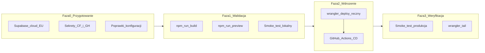

# Plan pierwszego wdrożenia BassMap PL

Dokument operacyjny pierwszego wdrożenia BassMap PL. Bazuje na [infrastructure.md](../foundation/infrastructure.md) (rekomendacja: Cloudflare Workers) i [tech-stack.md](../foundation/tech-stack.md) (GitHub Actions + auto-deploy-on-merge). Stack w kodzie to Astro 6 SSR + `@astrojs/cloudflare` v13 — **nie** Cloudflare Pages.

## Rekomendacja zakresu

**Wdrażamy obecny scaffold (landing + auth) jako smoke test produkcji** — nie czekamy na pełny MVP z listą wydarzeń i mapą.

Dlaczego tak:

- Kod i `wrangler.jsonc` są już na Workers (`wrangler deploy`); migracja na Pages byłaby krokiem wstecz
- Wczesny deploy wykrywa problemy runtime (Workers + Supabase SSR, sekrety, redirecty auth) przed budową funkcji z PRD
- Zgodne z tech-stack: CI na GitHub Actions, deploy po merge do `main`
- Koszt MVP: Workers Free (100k req/dzień) + Supabase Free — zgodnie z PRD (zero kosztów operacyjnych)



---

## Ocena planu — luki i poprawki

| Obszar | Stan przed planem | Poprawka w planie | Status |
|--------|-------------------|-------------------|--------|
| Platforma | `tech-stack.md` mówi „cloudflare-pages”; kod używa Workers | **Workers wygrywa** — Astro 6 + adapter v13 porzucił Pages | Zrobione |
| CI | Tylko `.github.scaffold/workflows/ci.yml` (nieaktywny), gałąź `master` | `.github/workflows/ci.yml`, gałąź `main` | Zrobione |
| CD | Brak workflow deploy | `.github/workflows/deploy.yml` na push do `main` | Zrobione |
| Nazwa Workera | `10x-astro-starter` w `wrangler.jsonc` | `bassmap-pl` | Zrobione |
| Supabase prod | Brak projektu w chmurze | Projekt EU (`dpqndrmvrkfahzyubrns.supabase.co`) | Zrobione |
| Sekrety CF | Tylko `.dev.vars` lokalnie | `wrangler secret put` lub `--secrets-file` | Zrobione |
| Sekrety GitHub | Brak | 4 sekrety w `ematrejek/bassmap-pl` | Zrobione |
| workers.dev | Brak subdomeny konta | Subdomena: `ematrejek.workers.dev` | Zrobione |
| URL produkcyjny | — | `https://bassmap-pl.ematrejek.workers.dev` | Do weryfikacji |
| Redirecty Supabase | Nieustawione | Site URL + Redirect URLs w Dashboard | **Do zrobienia** |
| Preview deploys | Brak | Poza pierwszym wdrożeniem (faza 2) | Zaplanowane |
| Własna domena | Brak | Później (DNS w Cloudflare) | Zaplanowane |
| Migracje DB | Brak `supabase/migrations/` | OK na scaffold — tylko `auth.users` | OK |

### Rozjazd tech-stack vs infrastructure

`tech-stack.md` (z bootstrapu) wskazuje `deployment_target: cloudflare-pages`. To historyczny hint ze startera. [infrastructure.md](../foundation/infrastructure.md) i aktualny kod (`wrangler.jsonc`, `main: "@astrojs/cloudflare/entrypoints/server"`) są źródłem prawdy: **deploy przez `wrangler deploy`, nie `wrangler pages deploy`**.

---

## Stan wykonania (checklist główny)

- [x] Dokument planu w `context/deployment/deploy-plan.md`
- [x] `wrangler.jsonc` → `name: "bassmap-pl"`
- [x] `.github/workflows/ci.yml` (lint + build na `main`)
- [x] `.github/workflows/deploy.yml` (auto-deploy na `main`)
- [x] `package.json` → skrypt `deploy`
- [x] Projekt Supabase w chmurze + `.dev.vars`
- [x] Sekrety Cloudflare Worker (`SUPABASE_URL`, `SUPABASE_KEY`)
- [x] GitHub Secrets (wszystkie 4)
- [x] Rejestracja subdomeny `ematrejek.workers.dev`
- [x] `npm run build` — sukces
- [x] `npm run lint` — sukces (po `npm run format`)
- [x] `npm run lint` + `npm run build` — sukces (2026-06-10)
- [x] `npm run deploy` — `https://bassmap-pl.ematrejek.workers.dev`
- [x] Smoke test produkcyjny — `/` 200, `/auth/*` 200, `/dashboard` → 302 `/auth/signin`
- [ ] Redirecty auth w Supabase Dashboard (ręcznie — patrz Faza 0.1)
- [ ] Push zmian do `main` (uruchomienie CI/CD)

---

## Faza 0 — Przygotowanie kont i sekretów

### 0.1 Supabase w chmurze

Projekt chmurowy jest skonfigurowany. Przed pierwszym publicznym testem auth:

1. Otwórz [Supabase Dashboard](https://supabase.com/dashboard) → projekt BassMap
2. **Authentication → URL Configuration**:
   - **Site URL**: `https://bassmap-pl.ematrejek.workers.dev`
   - **Redirect URLs**:
     - `https://bassmap-pl.ematrejek.workers.dev`
     - `https://bassmap-pl.ematrejek.workers.dev/**`
3. **Authentication → Email** (na smoke test):
   - Rozważ wyłączenie „Confirm email” — ułatwia test logowania admina
   - Przed publicznym launch: włącz z powrotem
4. **Wake projekt** przed demo — free tier usypia się po 7 dniach bezczynności

Klucze API (Settings → API):

| Zmienna | Opis |
|---------|------|
| `SUPABASE_URL` | Project URL |
| `SUPABASE_KEY` | `anon` public key |

### 0.2 Cloudflare — sekrety produkcyjne

```bash
npx wrangler login
npx wrangler secret put SUPABASE_URL
npx wrangler secret put SUPABASE_KEY
```

Alternatywnie przy deployu:

```bash
npm run build
npx wrangler deploy --secrets-file .dev.vars
```

**Nie commituj** `.dev.vars` — tylko lokalny dev (`astro.config.mjs` + `astro:env`).

Skrypt pomocniczy: `scripts/setup-deploy-secrets.ps1` (ustawia sekrety CF + GitHub z `.dev.vars`).

### 0.3 GitHub Secrets

W `ematrejek/bassmap-pl` → Settings → Secrets and variables → Actions:

| Secret | Cel | Status |
|--------|-----|--------|
| `SUPABASE_URL` | build w CI + runtime | Ustawiony |
| `SUPABASE_KEY` | build w CI + runtime | Ustawiony |
| `CLOUDFLARE_API_TOKEN` | deploy z Actions | Ustawiony |
| `CLOUDFLARE_ACCOUNT_ID` | identyfikator konta CF | Ustawiony |

Token API: minimalne uprawnienia — Account / Workers Scripts / Edit.

---

## Faza 1 — Poprawki konfiguracji w repozytorium

Wykonane zmiany:

| Plik | Zmiana |
|------|--------|
| `wrangler.jsonc` | `name: "bassmap-pl"`, `nodejs_compat`, observability |
| `.github/workflows/ci.yml` | `npm ci`, `astro sync`, lint, build na `main` |
| `.github/workflows/deploy.yml` | build + `cloudflare/wrangler-action@v3` na `main` |
| `package.json` | `"deploy": "npm run build && wrangler deploy"` |
| `scripts/setup-deploy-secrets.ps1` | automatyzacja sekretów z `.dev.vars` |

### wrangler.jsonc (docelowa konfiguracja)

```jsonc
{
  "$schema": "node_modules/wrangler/config-schema.json",
  "name": "bassmap-pl",
  "main": "@astrojs/cloudflare/entrypoints/server",
  "compatibility_date": "2026-05-08",
  "compatibility_flags": ["nodejs_compat"],
  "assets": {
    "binding": "ASSETS",
    "directory": "./dist",
    "not_found_handling": "404-page",
  },
  "observability": {
    "enabled": true,
  },
}
```

---

## Faza 2 — Walidacja przed produkcją

Wymagania: Node **22.14.0** (`.nvmrc`).

```bash
npm ci
npm run lint
npm run build
npm run preview
```

### Smoke test lokalny

- [ ] `/` — strona główna bez błędów 500
- [ ] Banner „Supabase nie jest skonfigurowany” **nie** widoczny (gdy `.dev.vars` ustawione)
- [ ] `/auth/signup` → rejestracja → `/auth/confirm-email` lub `/dashboard`
- [ ] `/auth/signin` → logowanie → redirect na `/`
- [ ] `/dashboard` bez sesji → redirect na `/auth/signin`
- [ ] `/api/auth/signout` — wylogowanie działa

Opcjonalnie: `npx wrangler deploy --dry-run`

---

## Faza 3 — Pierwszy deploy produkcyjny

```bash
npm run deploy
# lub:
npm run build && npx wrangler deploy --secrets-file .dev.vars
```

**Nie używać** `wrangler pages deploy` — przestarzałe dla tego stacku.

### Po deployu

1. Sprawdź URL: **https://bassmap-pl.ematrejek.workers.dev**
2. Zaktualizuj Site URL i Redirect URLs w Supabase (Faza 0.1)
3. Jeśli auth nie działa — najczęstsze przyczyny:
   - brak lub zły redirect URL w Supabase
   - brak sekretów w Workerze
   - włączone confirm email bez skonfigurowanego SMTP

### Rollback

```bash
npx wrangler deployments list
npx wrangler rollback
```

Rollback cofa **tylko kod Workera** — migracje Supabase są niezależne.

---

## Faza 4 — Weryfikacja produkcji

Powtórz smoke test z Fazy 2 na `https://bassmap-pl.ematrejek.workers.dev`.

### Logi na żywo

```bash
npx wrangler tail
npx wrangler tail --status error
```

### Obserwowalność

`observability.enabled: true` w `wrangler.jsonc` — Cloudflare Dashboard → Workers → bassmap-pl.

### Smoke test produkcyjny

- [ ] `/` — 200 OK
- [ ] `/auth/signin` — formularz renderuje się
- [ ] `/dashboard` bez sesji → redirect `/auth/signin`
- [ ] Rejestracja + logowanie admina działa
- [ ] Wylogowanie działa

---

## Faza 5 — Auto-deploy

Po udanym smoke teście:

1. Commit i push zmian do `main`
2. GitHub Actions uruchomi CI (lint + build) i Deploy (wrangler)
3. Każdy kolejny merge do `main` → automatyczny deploy

Workflow deploy wymaga sekretów z Fazy 0.3 — wszystkie są ustawione.

---

## Operacje na co dzień

| Akcja | Komenda |
|-------|---------|
| Dev lokalny | `npm run dev` (workerd, nie `wrangler dev`) |
| Build | `npm run build` |
| Preview lokalny | `npm run preview` |
| Deploy ręczny | `npm run deploy` |
| Logi prod | `npx wrangler tail` |
| Rollback | `npx wrangler rollback` |
| Lista deployów | `npx wrangler deployments list` |

### Zatwierdzenia (kto robi co)

Zgodnie z [infrastructure.md](../foundation/infrastructure.md):

| Akcja | Agent | Człowiek |
|-------|-------|----------|
| `npm run build`, `wrangler deploy --dry-run`, `wrangler tail` | Tak | — |
| Pierwszy deploy produkcyjny | Pomaga | Zatwierdza |
| Rotacja sekretów produkcyjnych | Pomaga | Zatwierdza |
| `wrangler delete`, migracje Supabase, zmiany DNS | — | Tak |

---

## Poza zakresem pierwszego wdrożenia

- Preview deploys na PR (`wrangler deploy --env preview`)
- Własna domena (DNS w Cloudflare)
- Cron health-check — budzenie Supabase free tier
- Workers Paid ($5/mo) — przed większym ruchem marketingowym
- Migracje Supabase dla tabel `events` (MVP z [prd.md](../foundation/prd.md))

---

## Rejestr ryzyk

| Ryzyko | Źródło | Prawdop. | Wpływ | Mitygacja |
|--------|--------|----------|-------|-----------|
| Workers ≠ Node.js | infrastructure | Średnia | Wysoki | `nodejs_compat`; test build + preview + smoke prod |
| CPU 10ms free tier | infrastructure | Średnia | Średni | Na scaffoldzie OK; monitoruj po mapie/filtrach |
| Stare tutoriale Pages | infrastructure | Wysoka | Średni | Tylko `wrangler deploy` w docs i CI |
| Supabase latency EU | infrastructure | Średnia | Niski | Region EU; minimalizuj round-tripy SSR |
| Supabase free tier sleep | infrastructure | Średnia | Średni | Wake przed demo; cron w fazie 2 |
| Brak preview → bugi na prod | infrastructure | Wysoka | Średni | Smoke przed CD; preview env w fazie 2 |
| Viral traffic > 100k req/dzień | infrastructure | Niska | Średni | Workers Paid przed marketingiem |
| Token API w czacie | operacyjne | — | Wysoki | Rotacja tokenu CF po konfiguracji |

---

## Kolejność wykonania (skrót)

1. ~~Supabase cloud (EU) + sekrety CF + GitHub Secrets~~
2. ~~Poprawki: `wrangler.jsonc`, CI na `main`, `deploy.yml`~~
3. Lokalny build + preview + smoke
4. `npm run deploy` + aktualizacja redirectów Supabase
5. Smoke na produkcji + `wrangler tail`
6. Push do `main` → auto-deploy z GitHub Actions
